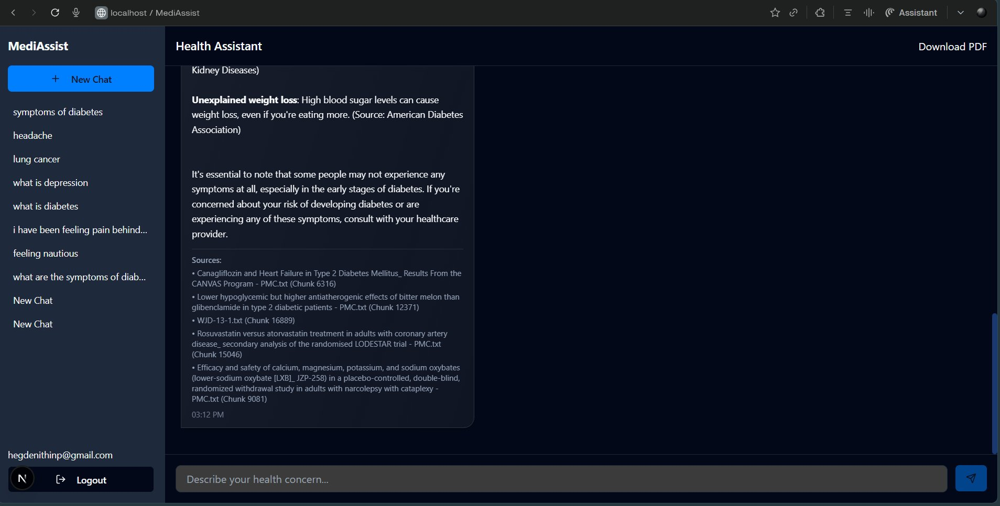
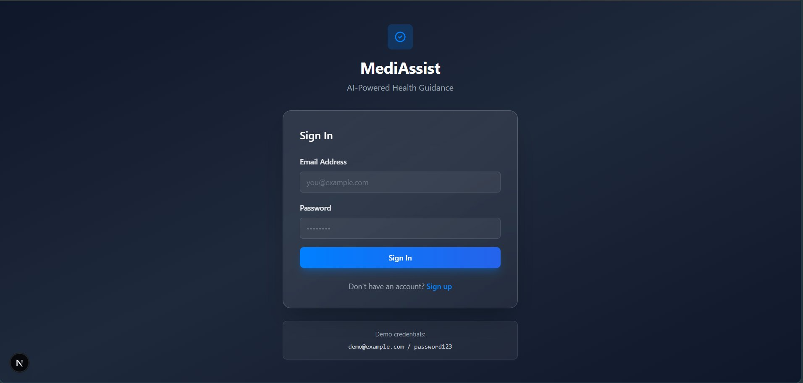
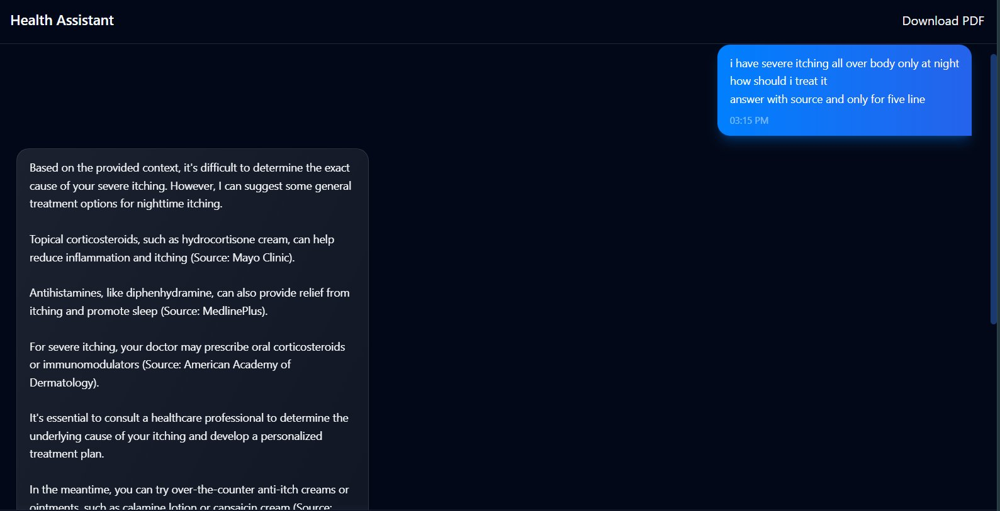
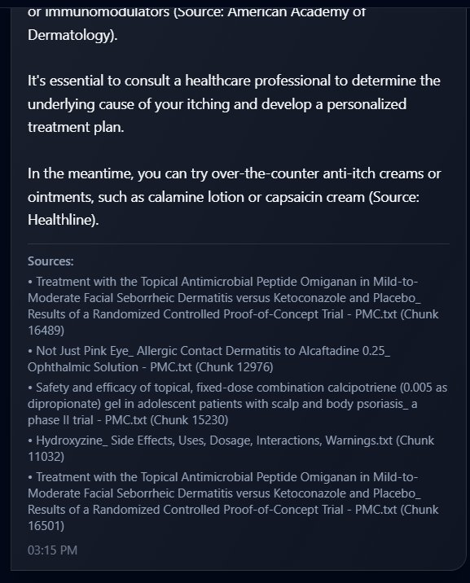
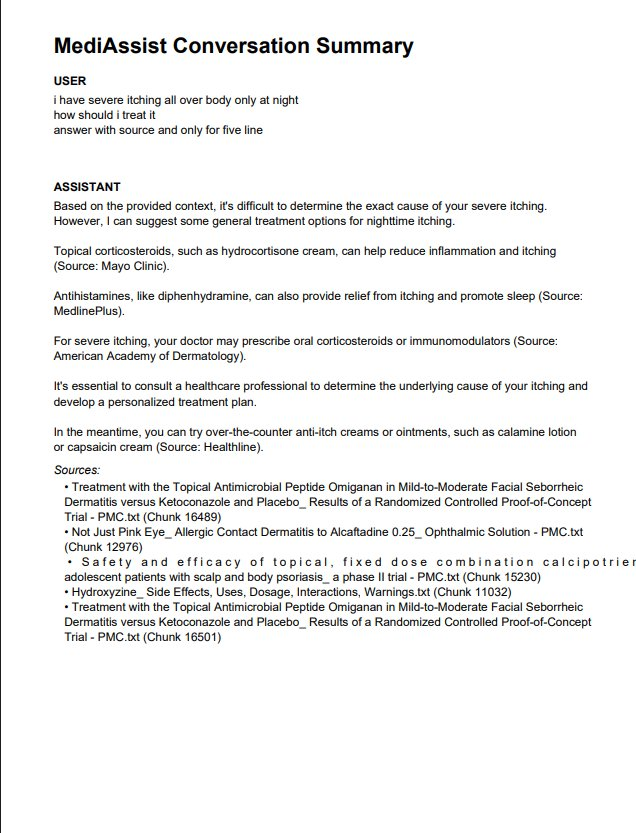

# 🏥 MediAssist — Medical RAG Chatbot

A full-stack AI-powered medical question answering application built with **RAG (Retrieval-Augmented Generation)**. Users can ask medical questions about diseases, medicines, and symptoms, and receive structured, context-grounded answers sourced from ingested medical PDFs.

> ⚠️ **Disclaimer:** This application is for informational purposes only and does not replace professional medical advice, diagnosis, or treatment.

---



---

## ✨ Features

- 🔐 **JWT Authentication** — Secure signup/login with bcrypt-hashed passwords
- 💬 **Conversational Chat** — Multi-turn chat with full conversation history
- 🧠 **RAG Pipeline** — Queries are answered using FAISS vector search over ingested medical documents
- 📄 **PDF Ingestion** — Upload and process medical PDFs into a searchable knowledge base
- 📋 **Structured Responses** — LLM auto-classifies queries (Disease / Medicine / Symptom / General) and formats answers accordingly
- 💾 **Chat History** — Conversations persisted in MongoDB, accessible from the sidebar
- 📥 **Download as PDF** — Export any conversation as a PDF report
- 🌙 **Dark/Light Mode** — Theme toggle via `next-themes`

---

## 🛠️ Tech Stack

### Backend
| Layer | Technology |
|---|---|
| API Framework | FastAPI |
| LLM Provider | Groq (via OpenAI-compatible SDK) |
| Vector Search | FAISS |
| Embeddings | `all-MiniLM-L6-v2` (SentenceTransformers) |
| Database | MongoDB (Motor async driver) |
| Auth | JWT (python-jose) + bcrypt (passlib) |
| PDF Parsing | pdfplumber |

### Frontend
| Layer | Technology |
|---|---|
| Framework | Next.js 14 (App Router) |
| Language | TypeScript |
| UI Components | shadcn/ui + Tailwind CSS |
| PDF Export | jsPDF |
| Auth State | React Context API |

---

## 📁 Project Structure

```
medical-c/
├── backend/
│   ├── api/
│   │   ├── app.py              # FastAPI app, CORS, router registration
│   │   ├── auth.py             # JWT creation, password hashing
│   │   ├── database.py         # MongoDB client + collections
│   │   ├── models/             # Pydantic models (user, chat, request)
│   │   └── routes/
│   │       ├── auth_routes.py  # POST /signup, POST /login
│   │       ├── rag_routes.py   # POST /ask (RAG + chat history)
│   │       └── chat_routes.py  # Conversation management endpoints
│   ├── embeddings/
│   │   └── build_index.py      # Builds FAISS index from chunks
│   ├── ingestion/
│   │   ├── extract_text.py     # PDF → raw text
│   │   ├── clean_text.py       # Text normalization
│   │   └── chunk_text.py       # Splits text into chunks
│   ├── llm/
│   │   └── generator.py        # Groq LLM calls (single + multi-turn)
│   └── rag/
│       └── retriever.py        # FAISS semantic search
│
├── frontend/
│   ├── app/
│   │   ├── page.tsx            # Main chat UI
│   │   ├── (auth)/
│   │   │   ├── login/          # Login page
│   │   │   └── signup/         # Signup page
│   │   └── chat/               # Chat layout
│   ├── components/
│   │   ├── AuthContext.tsx      # Global auth state
│   │   ├── MessageBubble.tsx    # Chat message renderer
│   │   ├── ProtectedRoute.tsx   # Route guard
│   │   └── ui/                 # shadcn/ui component library
│   ├── hooks/
│   │   └── useChatHistory.ts   # Chat history hook
│   ├── lib/
│   │   ├── api-client.ts       # Axios/fetch wrapper
│   │   └── types.ts            # Shared TypeScript types
│   └── services/
│       └── api.ts              # API service methods
```

---

## ⚙️ Setup & Installation

### Prerequisites

- Python 3.10+
- Node.js 18+
- MongoDB (local or Atlas)
- A [Groq API key](https://console.groq.com/)

---

### 1. Clone the Repository

```bash
git clone https://github.com/your-username/medical-c.git
cd medical-c
```

---

### 2. Backend Setup

```bash
cd backend
pip install -r requirements.txt
```

Create a `.env` file in the `backend/` directory:

```env
MONGO_URL=mongodb://localhost:27017
JWT_SECRET=your_super_secret_key

# Groq via OpenAI-compatible SDK
OPENAI_API_KEY=your_groq_api_key
OPENAI_BASE_URL=https://api.groq.com/openai/v1
OPENAI_MODEL=llama3-8b-8192
```

---

### 3. Ingest Medical PDFs

Place your PDF files in `backend/data/pdfs/`, then run the ingestion pipeline:

```bash
# Step 1: Extract text from PDFs
python ingestion/extract_text.py

# Step 2: Clean and chunk the text
python ingestion/clean_text.py
python ingestion/chunk_text.py

# Step 3: Build FAISS index
python embeddings/build_index.py
```

This will generate:
- `data/chunks.json` — chunked text
- `data/medical.index` — FAISS vector index
- `data/metadata.json` — chunk metadata

---

### 4. Run the Backend

```bash
cd backend
uvicorn api.app:app --reload --port 8000
```

API will be live at `http://localhost:8000`. Interactive docs at `http://localhost:8000/docs`.

---

### 5. Frontend Setup

```bash
cd frontend
npm install
npm run dev
```

Frontend will be live at `http://localhost:3000`.

---



---

## 🔌 API Endpoints

| Method | Endpoint | Auth | Description |
|---|---|---|---|
| `POST` | `/signup` | ❌ | Register a new user |
| `POST` | `/login` | ❌ | Login, returns JWT token |
| `POST` | `/ask` | ✅ | Ask a medical question (RAG) |
| `POST` | `/conversations` | ✅ | Create a new conversation |
| `GET` | `/conversations` | ✅ | List all user conversations |
| `GET` | `/conversations/{id}/messages` | ✅ | Get messages in a conversation |

---



---

## 🧠 How the RAG Pipeline Works

```
User Question
     │
     ▼
Embed with all-MiniLM-L6-v2
     │
     ▼
FAISS Semantic Search  ──→  Top 5 relevant chunks from medical PDFs
     │
     ▼
Build prompt with context + conversation history
     │
     ▼
Groq LLM (Llama 3)  ──→  Structured answer with sources
     │
     ▼
Save to MongoDB  ──→  Return answer + source references to frontend
```

---



---

## 🔒 Authentication Flow

1. User signs up — password is SHA-256 hashed, then bcrypt hashed before storage.
2. On login, a **JWT token** (HS256, 12-hour expiry) is issued.
3. All protected routes require a `Bearer <token>` in the `Authorization` header.
4. The frontend stores the token and attaches it to every API request automatically.

---

## 📤 PDF Export

From any active conversation, click **"Download PDF"** in the chat header to export the full conversation as a formatted PDF, including source references for each assistant message.

---



---

## 🤝 Contributing

1. Fork the repository
2. Create a feature branch: `git checkout -b feature/your-feature`
3. Commit your changes: `git commit -m 'Add your feature'`
4. Push and open a Pull Request

---

## 📄 License

This project is licensed under the MIT License. See [LICENSE](LICENSE) for details.
